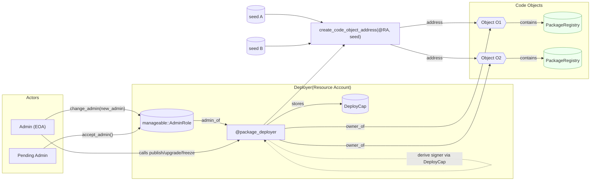
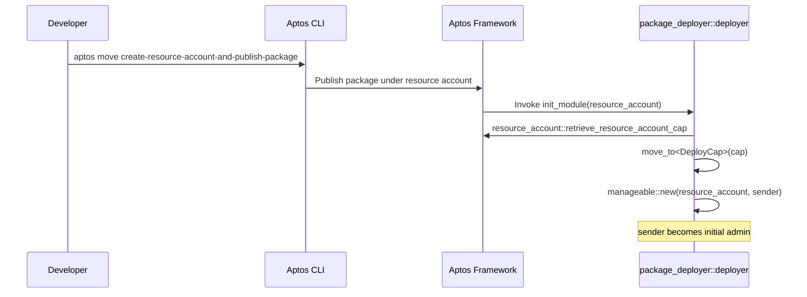
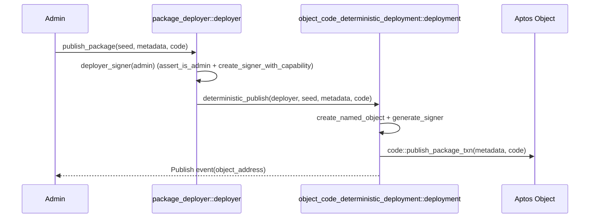
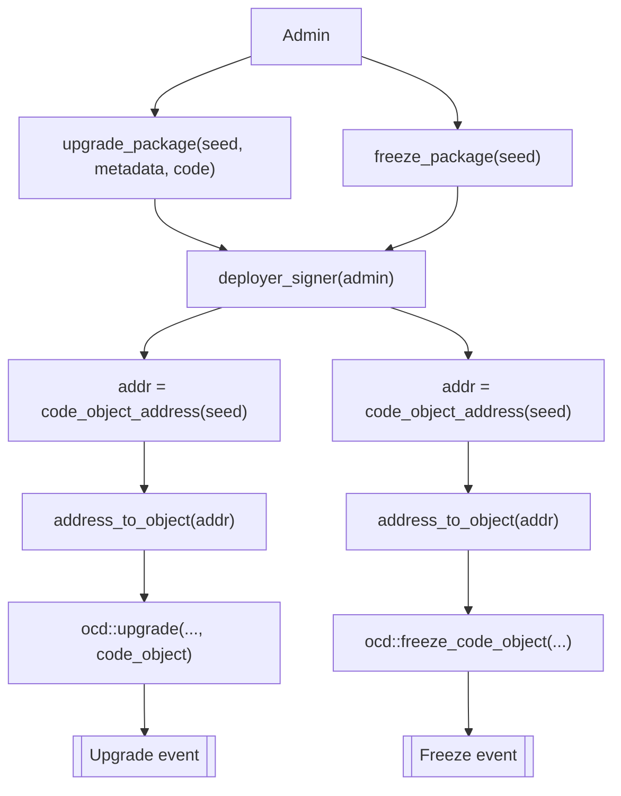

# Yeaptor

Yeaptor is a set of Aptos Move packages and lightweight tools to help developers build, deploy, and manage smart contracts on Aptos with predictable addresses and safer upgrade paths.

## Highlights
- Deterministic addresses for code and resource accounts
- Safer upgrade lifecycle with explicit freeze mechanics
- Admin-gated orchestration via a resource-account deployer
- Composable, framework-aligned Move patterns

## What’s inside
- [packages/object-code-deterministic-deployment](packages/object-code-deterministic-deployment/README.md)
  Deterministically publish Move packages to Aptos Objects, with support for upgrades and freezing, plus a view to pre-compute the object address.
- [packages/proxy-account](packages/proxy-account/README.md)
  Create deterministic proxy (resource) accounts with admin-controlled signer generation and a secure two-step admin transfer flow via the accompanying `manageable` module.
- [packages/deployer](packages/deployer/README.md)
  Resource-account deployer that admin-gates deterministic publish/upgrade/freeze to Aptos Objects. Provides seed-based convenience flows and explicit object variants.

## Why Yeaptor
- Deterministic addresses: Predict where code or resource accounts will live before deployment (useful for integrations and off-chain references).
- Controlled upgrades: Upgrade packages deployed to objects, or freeze them to make them immutable.
- Operational safety: Two-step admin handover for proxies reduces risks from accidental key transfers.
- Composability: Patterns designed to compose with existing Aptos Framework primitives.

## Typical use cases
- Protocol-owned “factories” and modules at stable, pre-known addresses
- Managed proxy accounts for automation, custody, or delegated execution
- Cross-environment coordination where addresses must be known ahead of time
- Safer lifecycle: upgrade during rollout, freeze when finalized

## 5‑minute quickstart
1) Prerequisites: Aptos CLI installed and a profile initialized (devnet/testnet/mainnet)
2) Build the packages (use --dev for local dev addresses):
   - cd packages/object-code-deterministic-deployment && aptos move compile --dev
   - cd packages/proxy-account && aptos move compile --dev
   - cd packages/deployer && aptos move compile --dev
3) Explore package READMEs for usage and API details
   - Object deployment: deterministic publish/upgrade/freeze to objects
   - Proxy accounts: create/generate admin-gated resource account signers
   - Deployer: resource-account admin orchestrates deterministic deployments

## Account relationships (who owns/controls what)

## Deployment diagrams

### 1) Create Deployer via Resource-account publish and init flow

### 2) Deterministic publish via deployer

### 3) Upgrade/freeze via seed wrappers

## Getting started
- Requires Aptos CLI and an initialized profile
- Build and test each package separately in `packages/*`
- See each package’s Move sources and README for details and examples

## Who is this for?
- Protocol teams needing predictable addresses and controlled rollouts
- Wallets, custodians, and automation systems managing delegated execution
- Developers standardizing on modern Aptos object and resource-account patterns

## Roadmap
- Turnkey scripts/SDK for packaging metadata/code and submitting transactions
- Example dapps and e2e test flows for testnet/mainnet
- Optional deployer-level events and richer views for observability

## Project status
These modules target the Aptos mainnet framework revision defined in each `Move.toml`. Review, testing, and audits are recommended before production use.

## Contributing
Issues and PRs are welcome. Please include clear repro steps and tests where possible.

## License
Apache-2.0. See `LICENSE`.
