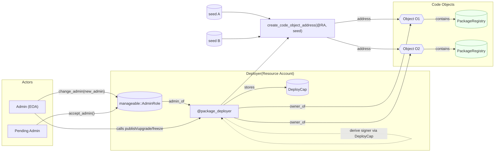
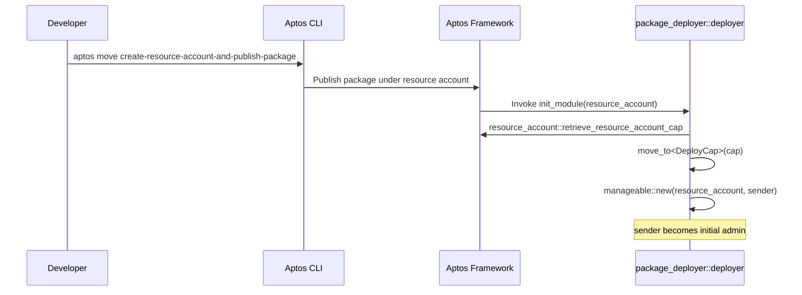
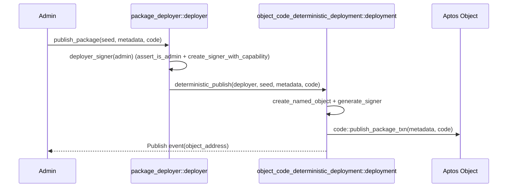
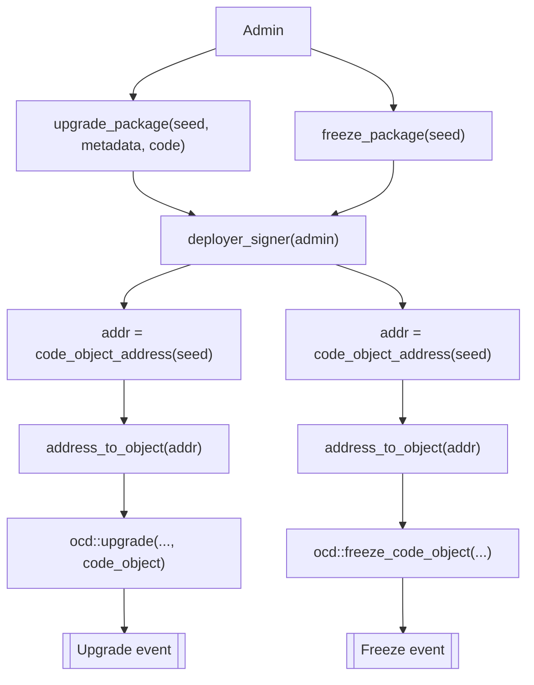

# Package Deployer

`package-deployer` is an on-chain resource-account package that lets you deterministically publish, upgrade, and freeze Move packages using Aptos Objects. It wraps the lower-level `object_code_deterministic_deployment::deployment` API and adds admin-gated operations through a managed resource account.

## Key features
- Deterministic object address deployment using a seed
- Admin-gated deploy/upgrade/freeze via a resource account
- Two-step admin transfer (manageable module semantics)
- View to pre-compute code object address for a seed

## How it works
- Publish this package with the CLI command:
  aptos move create-resource-account-and-publish-package --dev
- The framework calls `init_module(resource_account)` after publish (not an entry):
  - Retrieves and stores the resource account SignerCapability in `DeployCap`
  - Initializes admin management so only the initial sender can operate the deployer
- Subsequent calls require the admin and derive the deployer signer internally.

## Public entry functions
- publish_package(admin, seed, metadata_serialized, code)
  Publish a package to a deterministic object address.
- upgrade_package(admin, seed, metadata_serialized, code)
  Upgrade a package; derives the code object from the seed.
- freeze_package(admin, seed)
  Freeze a package; derives the code object from the seed.
- upgrade_code_object(admin, metadata_serialized, code, code_object)
  Upgrade by passing an explicit `Object<PackageRegistry>`.
- freeze_code_object(admin, code_object)
  Freeze by passing an explicit `Object<PackageRegistry>`.
- code_object_address(seed) -> address [view]
  Pre-compute the object address for a given seed (publisher is the deployer resource account).
- retire(admin)
  Remove admin state and destroy the stored capability to decommission the deployer.

## Typical use cases
- Protocol-owned “factories” and modules at stable, pre-known addresses
- Managed proxy accounts for automation, custody, or delegated execution
- Cross-environment coordination where addresses must be known ahead of time
- Safer lifecycle: upgrade during rollout, freeze when finalized

## 5‑minute quickstart
1) Prerequisites: Aptos CLI installed and a profile initialized (devnet/testnet/mainnet)
2) Build the packages (use --dev for local dev addresses):
   - cd packages/object-code-deterministic-deployment && aptos move compile --dev
   - cd packages/proxy-account && aptos move compile --dev
   - cd packages/deployer && aptos move compile --dev
3) Explore package READMEs for usage and API details
   - Object deployment: deterministic publish/upgrade/freeze to objects
   - Proxy accounts: create/generate admin-gated resource account signers
   - Deployer: resource-account admin orchestrates deterministic deployments

## Account relationships (who owns/controls what)

## Deployment diagrams

### 1) Create Deployer via Resource-account publish and init flow

### 2) Deterministic publish via deployer

### 3) Upgrade/freeze via seed wrappers

## CLI tips
- Use --dev for local builds/tests so dev-addresses resolve:
  aptos move compile --dev
  aptos move test --dev
- For publish/upgrade, pass package-metadata.bcs and module bytecode blobs; most users will call through an off-chain tool that encodes vector<vector<u8>>.

## Security notes
- Only the admin can operate the deployer; admin transfers use the two-step manageable flow.
- Freezing is irreversible.

## Dependencies
- AptosFramework (mainnet rev)
- object-code-deterministic-deployment (local dependency)