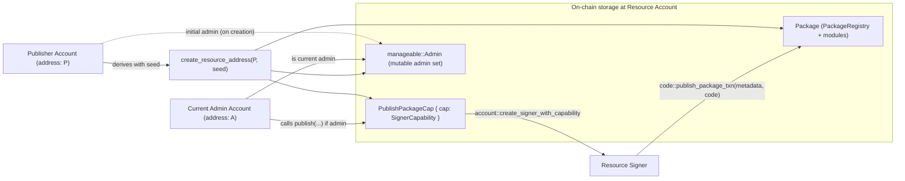

# Resource Account Code Deployment

Deterministic deployment and upgrade of Move packages to resource accounts using a publisher-provided seed. This package provides a lightweight alternative to object-based deployment by relying on Aptos resource accounts and an admin model.

Module: `ra_code_deployment::ra_code_deployment`

## Overview

- Compute a deterministic resource account address from `(publisher, seed)`.
- Lazily initialize the resource account and store a capability for future upgrades.
- Publish or upgrade a package under that resource account with admin authorization.
- Optionally freeze management by removing admin and the stored capability.

This package does not emit events.

## Concepts

- Deterministic address: `create_resource_address(publisher, seed)`
- Admin model: Uses `aptos_extensions::manageable` to gate publish/upgrade to admins.
- Capability storage: `PublishPackageCap` (stored under the resource account) holds the `SignerCapability` needed to sign upgrades.

## Public API

- `create_resource_account(publisher: &signer, seed: vector<u8>)`
  - Creates the resource account derived from `(publisher, seed)`; aborts if it already exists.
  - Stores `PublishPackageCap` and initializes manageable admin with `publisher` as admin.

- `deploy(publisher: &signer, seed: vector<u8>, metadata_serialized: vector<u8>, code: vector<vector<u8>>) acquires PublishPackageCap`
  - Ensures the resource account exists (calls `create_resource_account` if missing), then publishes the package to that resource account (equivalent to upgrade if already published).

- `publish(admin: &signer, metadata_serialized: vector<u8>, code: vector<vector<u8>>, resource_address: address) acquires PublishPackageCap`
  - Requires `admin` to be a manageable admin for `resource_address`.
  - Uses `PublishPackageCap` to create the resource account signer and calls `code::publish_package_txn` to publish/upgrade.

- `freeze_resource_account(admin: &signer, resource_address: address) acquires PublishPackageCap`
  - Requires admin.
  - Revokes management by destroying the manageable resource and removes `PublishPackageCap`, preventing further publishes/upgrades via this module.

## Storage

Under the resource account address:
- `PublishPackageCap { cap: SignerCapability }`
- Manageable admin resource (via `aptos_extensions::manageable`)

## Account Relationships

Note: A may equal P. If admin changes away from P, deploy(publisher, ...) will fail the admin check; the current admin must call publish(admin, ..., resource_address).

## Notes

- Functions are `public` (not entry) and intended to be used from other Move modules or scripts that obtain the appropriate `signer`.
- If you require an indexer signal for publishes/upgrades, consider adding events in your own fork or use the object-based deployment package that already emits events.
